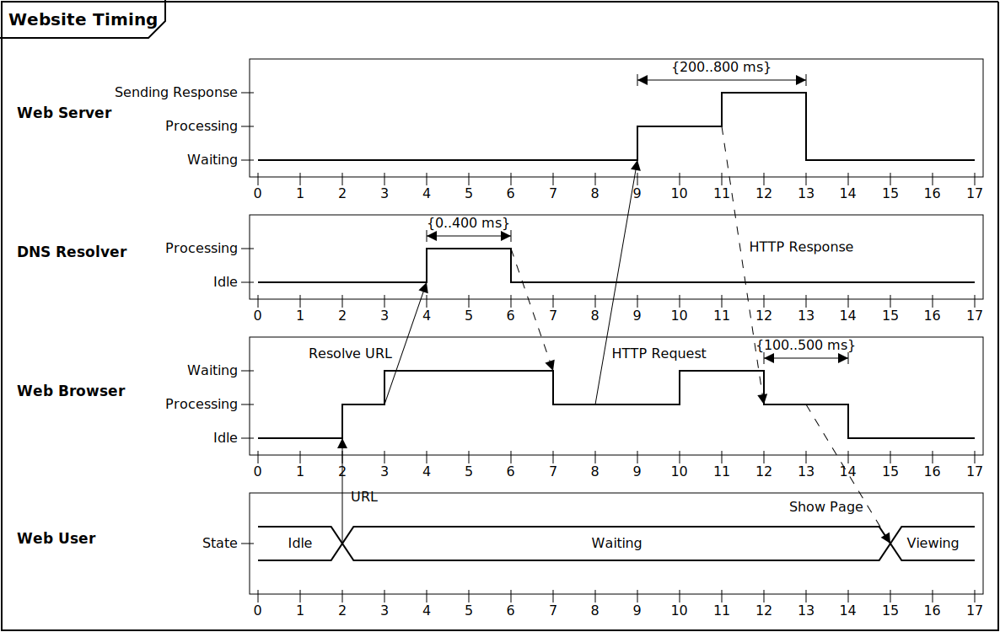
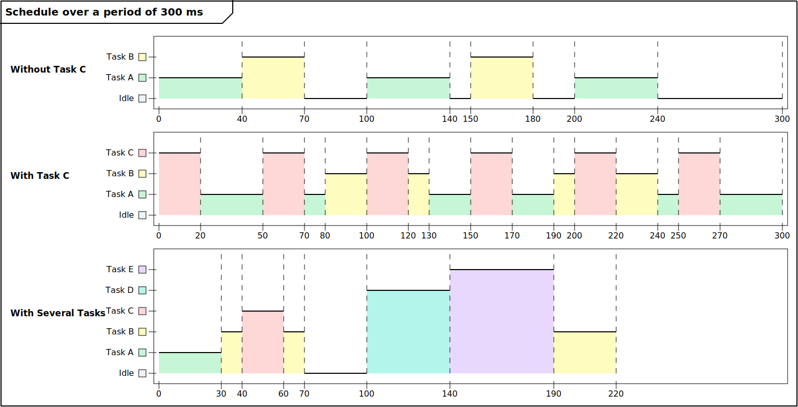

# UML Timing Diagram Generator
Generate UML timing diagrams from text-based descriptions

## Setup
```
npm i -g timing-diagram-generator
tdg my_diagram.tdg > output.svg
```

### Installing the Vim syntax
With vim-plug:
```
Plug 'jayden-chan/timing-diagram-generator', { 'branch': 'vim-plugin' }
```

## Examples
### Website Example ([source](./examples/2-website.tdg))

### Simple ([source](./examples/1-simple.tdg))

### Task Scheduler ([source](./examples/3-scheduler.tdg))


## Full Usage

### Config
Syntax
```
config VARIABLE_NAME value
```
Example
```
config TICK_WIDTH 50
config LEGEND_FREQUENCY 5

# label the axis every `LEGEND_FREQUENCY` ticks
config LEGEND_MODE freq

# label the axis on each state change
config LEGEND_MODE significant
```

### Title
Syntax
```
title "<title>"
```
Example
```
title "My Diagram Title"
```

### Lifeline
Syntax
```
lifeline "<lifeline>"
```
Example
```
lifeline "My Lifeline"
```

### State
Syntax
```
state "<lifeline>" "<state name>" <index>
```
Example
```
state "My Lifeline" "My First State" 0
state "My Lifeline" "My Second State" 1
```

### Tick
Syntax
```
T<index> "<lifeline>" <state index>
```
Example
```
T0 "My Lifeline" 0
T7 "My Lifeline" 1
T9 "My Lifeline" 0
```

### Span
Syntax
```
span "<lifeline>" T<start index>:T<end index> "<label text>"
```
Example
```
span "My Lifeline" T0:T7 "{0...400 ms}"
```

### Arrow
Syntax
```
# Simple
T<start index>:"<start lifeline>" -> T<end index>:"<end lifeline>"

# Dashed line
T<start index>:"<start lifeline>" => T<end index>:"<end lifeline>"

# With label at % of arrow length
T<start index>:"<start lifeline>" -> T<end index>:"<end lifeline>" "<label>":<label %>

# Label on left/right side
T<start index>:"<start lifeline>" -> T<end index>:"<end lifeline>" "<label>":<label %>:L/R

# Arrow connecting to the upper part of the timeline
T<start index>:"<start lifeline>" -> T<end index>:"<end lifeline>":<connection point>
```
Examples
```
# Simple Arrow
T6:"DNS Resolver" -> T7:"Web Browser"

# Dashed line arrow
T6:"DNS Resolver" => T7:"Web Browser"

# With label "URL" at 40% of the arrow length
T2:"Web User" -> T2:"Web Browser" "URL":40

# With label at 38% of the arrow length on the left side
T3:"Web Browser" -> T4:"DNS Resolver" "Resolve URL":38:L

# Arrow connecting to the upper part of the timeline at T12
T11:"Web Server" => T12:"Web Browser":1 "HTTP Response":45
```

### Lifeline Timeline Style
Syntax
```
style "<lifeline>" Normal|Simplified|Slice
```
Example
```
# display a line graph representing the changes in state
style "My Lifeline" Normal

# only display one state at a time
style "My Lifeline" Simplified

# Display color-coded slices representing the current state
style "My Lifeline" Slice
```

### Macros
Syntax
```
macro <name> <value>
```
Example
```
macro MyMacro "Sending update to server"

# expands to `lifeline "Sending update to server"`
lifeline MyMacro

state MyMacro "My First State" 0
state MyMacro "My Second State" 1
```
