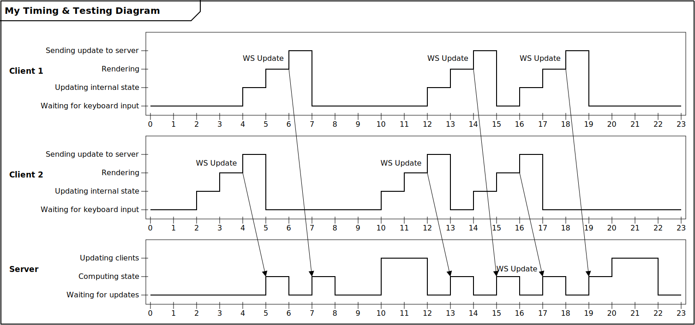

# UML Timing Diagram Generator
Generate UML timing diagrams from text-based descriptions

## Setup
```
npm i -g timing-diagram-generator
tdg my_diagram.tdg > output.svg
```

## Examples
### Simple ([source](/examples/1-simple.tdg))

### Website Example ([source](/examples/2-website.tdg))


## Full Usage

### Title
Syntax
```
title "<title>"
```
Example
```
title "My Diagram Title"
```

### Lifeline
Syntax
```
lifeline "<lifeline>"
```
Example
```
lifeline "My Lifeline"
```

### State
Syntax
```
state "<lifeline>" "<state name>" <index>
```
Example
```
state "My Lifeline" "My First State" 0
state "My Lifeline" "My Second State" 1
```

### Tick
Syntax
```
T<index> "<lifeline>" <state index>
```
Example
```
T0 "My Lifeline" 0
T7 "My Lifeline" 1
T9 "My Lifeline" 0
```

### Span
Syntax
```
span "<lifeline>" T<start index>:T<end index> "<label text>"
```
Example
```
span "My Lifeline" T0:T7 "{0...400 ms}"
```

### Arrow
Syntax
```
# Simple
T<start index>:"<start lifeline>" -> T<end index>:"<end lifeline>"

# Dashed line
T<start index>:"<start lifeline>" => T<end index>:"<end lifeline>"

# With label at % of arrow length
T<start index>:"<start lifeline>" -> T<end index>:"<end lifeline>" "<label>":<label %>

# Label on left/right side
T<start index>:"<start lifeline>" -> T<end index>:"<end lifeline>" "<label>":<label %>:L/R

# Arrow connecting to the upper part of the timline
T<start index>:"<start lifeline>" -> T<end index>:"<end lifeline>":<connection point>
```
Examples
```
# Simple Arrow
T6:"DNS Resolver" -> T7:"Web Browser"

# Dashed line arrow
T6:"DNS Resolver" => T7:"Web Browser"

# With label "URL" at 40% of the arrow length
T2:"Web User" -> T2:"Web Browser" "URL":40

# With label at 38% of the arrow length on the left side
T3:"Web Browser" -> T4:"DNS Resolver" "Resolve URL":38:L

# Arrow connecting to the upper part of the timline at T12
T11:"Web Server" => T12:"Web Browser":1 "HTTP Response":45
```

### Lifeline Timeline Style
Syntax
```
style "<lifeline>" Normal|Simplified
```
Example
```
style "My Lifeline" Normal
style "My Lifeline" Simplified
```

## Installing the Vim syntax
Find your vim runtime path:
```
:echo &runtimepath
```
The path will be the first one in the list of paths returned. To install the `.tdg`
syntax file simply place `tdg.vim` in your runtime path and add the following to your
vimrc:
```vimscript
au BufRead,BufNewFile *.tdg set filetype=tdg
```
